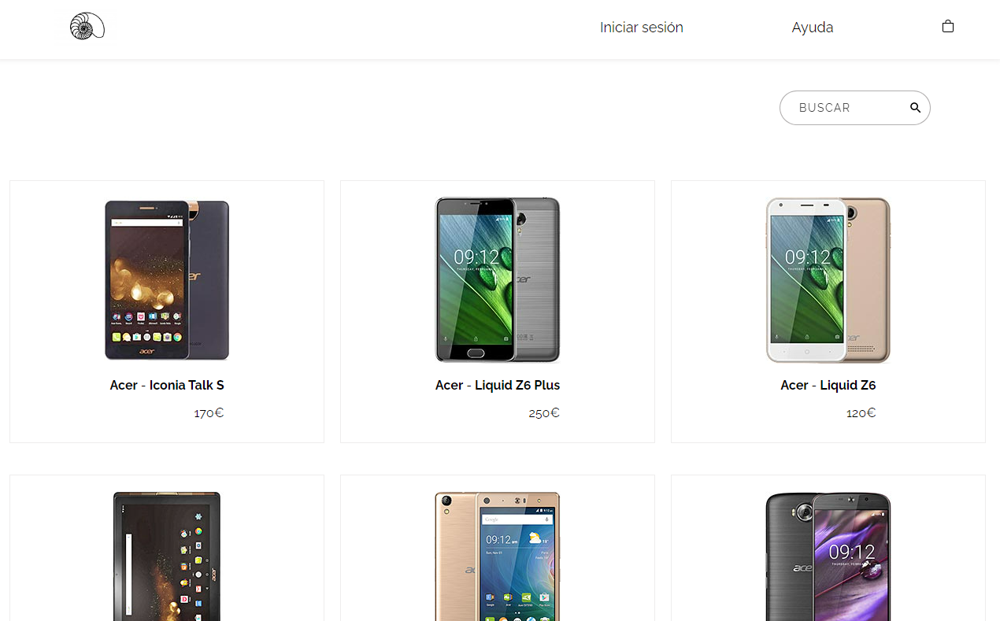
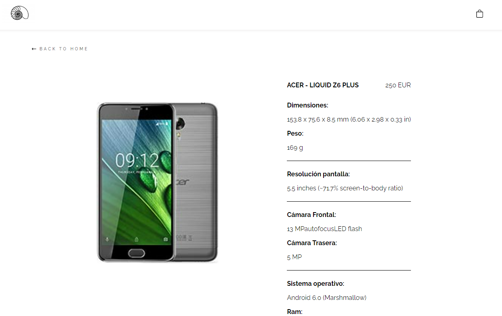
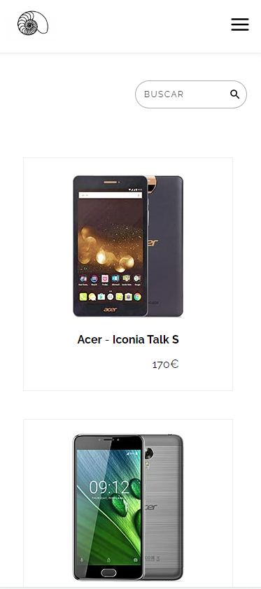
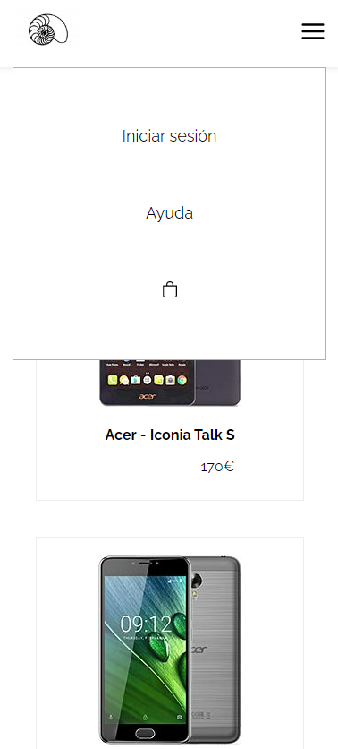
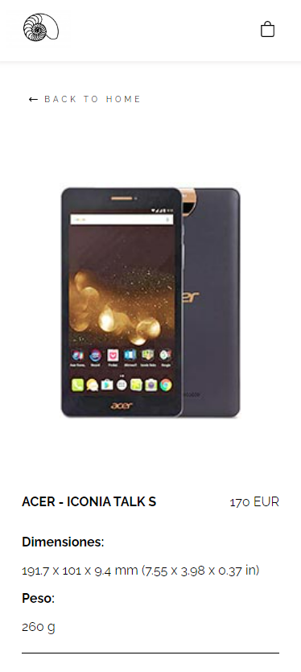

# Frontend Developer - Verónica Isla

Esta prueba consiste en la creación de una mini-aplicación para comprar dispositivos moviles.

 La aplicación tendrá únicamente dos vistas:
1. Vista principal - Listado de productos
2. Detalles del producto

##### DESCRIPCION DE LAS VISTAS

1. PLP - Product List Page

• Pagina donde se visualizará la lista de los productos. ✅

• Esta pagina, se mostrarán todos los elementos que nos devuelve la petición del API ✅

• Permitirá el filtrado del contenido en función del criterio de busqueda que el usuario ✅
introduzca

• Al seleccionar un producto, deberá navegar a los detalles del mismo. ✅

• Se mostrarán un maximo de cuatro elementos por fila, y que sea adaptativo segun la
resolución ✅

2. PDP - Product Details Page

• Esta pagina de dividirá en dos columnas: ✅

• En la primera se mostrará el componente de la imagen del producto ✅

• En la segunda, se mostrará los detalles y las acciones del producto ✅ ---> Falta parte de la funcionalidad

• Deberá mostrar un link para navegar de vuelta a la lista de productos. ✅

##### - Vista versión ordenador

##### - Vista versión móvil

